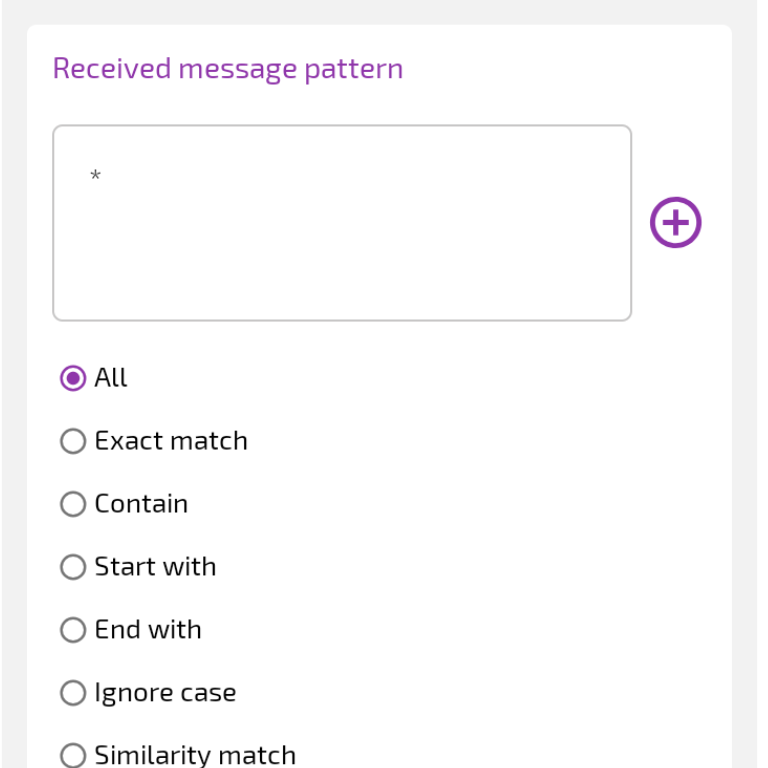
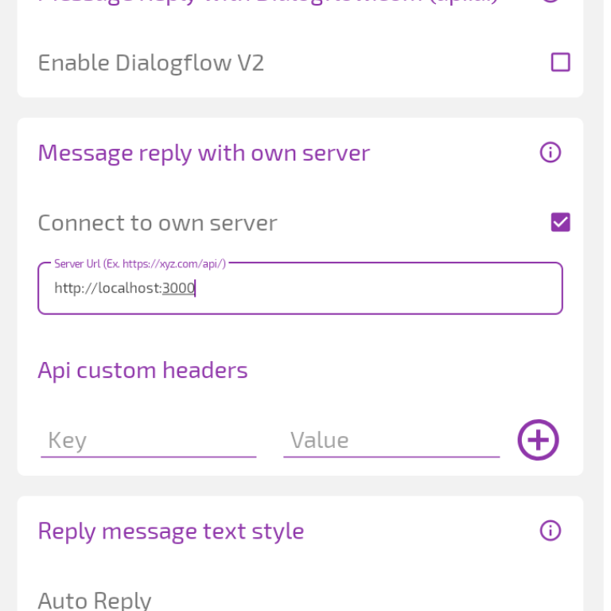

# Open AI WhatsApp Bot

Este é um exemplo de como usar a API Open AI com JavaScript e de como criar um chat bot para o WhatsApp

## Instalação

Antes de começar, você deve ter um token do OpenAI. Crie um [aqui](https://beta.openai.com/account/api-keys)

Também será utilizado um app de respostas automáticas para o WhatsApp e o Termux

Instale o Auto Reply pela Play Store [aqui](https://play.google.com/store/apps/details?id=com.pransuinc.autoreply)

Instale o Termux pelo GitHub [aqui](https://github.com/termux/termux-app)

<details>
  <summary>Veja como configurar o Termux</summary>

  <br>

  - Atualize o Termux

  ```bash
  pkg upgrade
  ```

  - Instale o NodeJS e o Git

  ```bash
  pkg install nodejs-lts git
  ```

  - Instale o Yarn

  ```bash
  npm i -g yarn
  ```
</details>

<hr>

- Clone esse repositório

```bash
git clone https://github.com/jhondesignee/openai-wabot
```

- Acesse a pasta e instale as dependências

```bash
cd openai-wabot
yarn install
```

## Configuração

Crie um arquivo na raiz do projeto chamado ".env" e cole o token do Open AI

```bash
OPENAIKEY="seu token aqui"
```

No Auto Reply, crie uma nova regra com as seguintes configurações:

- responder a todas as mensagens

<div align="center">
  
</div>

- responder com seu próprio servidor

<div align="center">
  
</div>

<hr>

Com tudo configurado, inicie o bot

```bash
yarn start
```

O Auto Reply responderá a todas as notificações do WhatsApp que começarem com "/ask" seguido de um prompt
